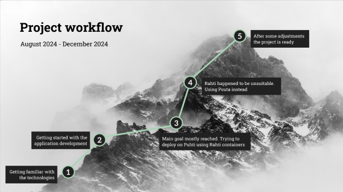
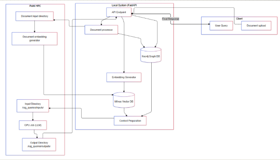

# Multimodal RAG Application



This project is a Retrieval-Augmented Generation (RAG) application built with FastAPI. The application leverages Milvus for vector storage, Neo4j for knowledge graphs, and integrates with a large language model (LLM) to provide multimodal capabilities.

## Table of Contents

- [Introduction](#introduction)
- [Requirements](#requirements)
- [Installation](#installation)
- [Workflow](#workflow)
- [Usage](#usage)
- [Running Tests](#running-tests)
- [License](#license)

## Introduction
Ragion is a multimodal RAG application designed to assist users and answer questions on specific topics. One potential use case for Ragion is assisting with information related to sheltered accommodation residents' experiences and living conditions. However, the application has many other potential uses. The main requirement for setting up this application is the availability of trustworthy material to serve as the source of the bot's knowledge. This material can include interviews, observations, experiment results, or any other kind of reliable and proven information. During the testing phase, interviews with sheltered accommodation residents were used to build the chatbot's knowledge base, and this material proved to be effective for bot training.

The application was implemented using open-source products, technologies, and free versions of commercial tools. It is divided into components, each running in an individual Docker container. The application logic is written in Python, using the FastAPI framework for the frontend and Streamlit for the backend. The free version of the Neo4j vector database was used as the knowledge base, while the Milvus database served as embedding storage. Langchain, Hugging Face Transformer Models, and TurkuNLP were used for query processing and embedding generation. Finally, the Finnish-NLP/llama-7b-finnish-instruct-v0.2 Large Language Model (LLM) was used to generate responses.

The application is resource-intensive and requires a high-powered environment for smooth operation. During development, it was deployed on a supercomputer, where it took approximately two to three minutes to generate a response. On a regular home computer, the waiting time was around 15 minutes.

More information about the essential technologies used in Ragion's development can be found in the following chapters.


## Requirements

Before you begin, ensure you have met the following requirements:

- Docker: [Install Docker](https://docs.docker.com/get-docker/)
- Docker Compose: [Install Docker Compose](https://docs.docker.com/compose/install/)

## Installation

Follow these steps to set up and run the application:

1. **Clone the Repository:**

    ```bash
    git clone https://github.com/tahasafdari/ragion
    cd ragion
    ```

2. **Build and Start the Application:**
    For local development create network:
    ```bash
    docker network create app_network
    ```

    Using Docker Compose, you can build and start the application along with its dependencies (Milvus and Neo4j):

    ```bash
    docker-compose up --build
    ```

    This command will:
    - Build the Docker image for the FastAPI application.
    - Start the Milvus and Neo4j services.
    - Launch the FastAPI application, accessible at `http://localhost:8000`.

3. **Access Neo4j Browser (Optional):**

    Neo4j’s web interface is available at `http://localhost:7474`. The default login credentials are:
    - Username: `neo4j`
    - Password: `test`

## Architecture and Workflow



The system is divided into three main components that work together to process documents and answer queries:

### 1. Client Interaction Layer

The client interface handles two primary operations:
- **Document Upload**: Users can upload trustworthy materials (e.g., interview transcripts, observations, research data)
- **Query Submission**: Users can ask questions about the uploaded content

### 2. Local System (FastAPI)

The FastAPI server manages the core processing pipeline:

#### Document Processing Flow
1. **API Endpoint** receives uploaded documents
2. **Document Processor**:
   - Validates and preprocesses documents
   - Extracts relevant information
   - Prepares content for embedding generation

3. **Embedding Generator**:
   - Creates vector representations of documents
   - Handles query embedding generation
   - Interfaces with Milvus for storage

4. **Database Integration**:
   - **Neo4j Graph DB**: Stores document relationships and metadata
   - **Milvus Vector DB**: Manages document and query embeddings

5. **Context Preparation**:
   - Retrieves relevant context based on query similarity
   - Combines information from both databases
   - Prepares consolidated context for LLM processing

### 3. Puhti HPC (High-Performance Computing)

The supercomputer environment handles computationally intensive tasks:

#### Document Processing on HPC
1. **Document Input Directory**:
   - Receives preprocessed documents
   - Manages document queue for processing

2. **Document Embedding Generator**:
   - Generates high-quality embeddings using GPU acceleration
   - Utilizes TurkuNLP and Hugging Face models
   - Returns embeddings for storage in Milvus

#### Query Processing on HPC
1. **Input Directory** (`/rag_queries/inputs/`):
   - Receives queries with relevant context
   - Prepares input for LLM processing 

2. **GPU Job (LLM)**:
   - Runs Finnish-NLP/llama-7b-finnish-instruct-v0.2 model
   - Processes queries with context
   - Generates responses (2-3 minutes on supercomputer)

3. **Output Directory** (`/rag_queries/outputs/`):
   - Stores generated responses
   - Makes them available for retrieval

### Complete Workflow Example

Using the sheltered accommodation use case as an example:

1. **Document Ingestion**:
   - Staff uploads resident interview transcripts
   - Documents are processed and embedded
   - Knowledge is stored in Neo4j and Milvus

2. **Query Processing**:
   - User asks about resident experiences
   - System generates query embedding
   - Relevant interview segments are retrieved
   - Context is prepared with related information

3. **Response Generation**:
   - Query and context are sent to HPC
   - LLM processes the information
   - Response is generated based on actual resident feedback
   - Answer is returned to user (2-3 minutes on supercomputer)

## Usage

    in case if you get the permission denied for multimodal_rag_app container please execute the following:
    
    
    
    Linux Machine:
    ```bash
    chmod +x ./scripts/start-dev.sh
    ```
    
    Windows Machine:


## Running Tests
    Make sure the services are running and run the tests using pytest:
    ```bash
    docker exec -it multimodal_rag_app pytest
    ```


    

## License

This project is licensed under the MIT License. See the [LICENSE](LICENSE) file for details.


